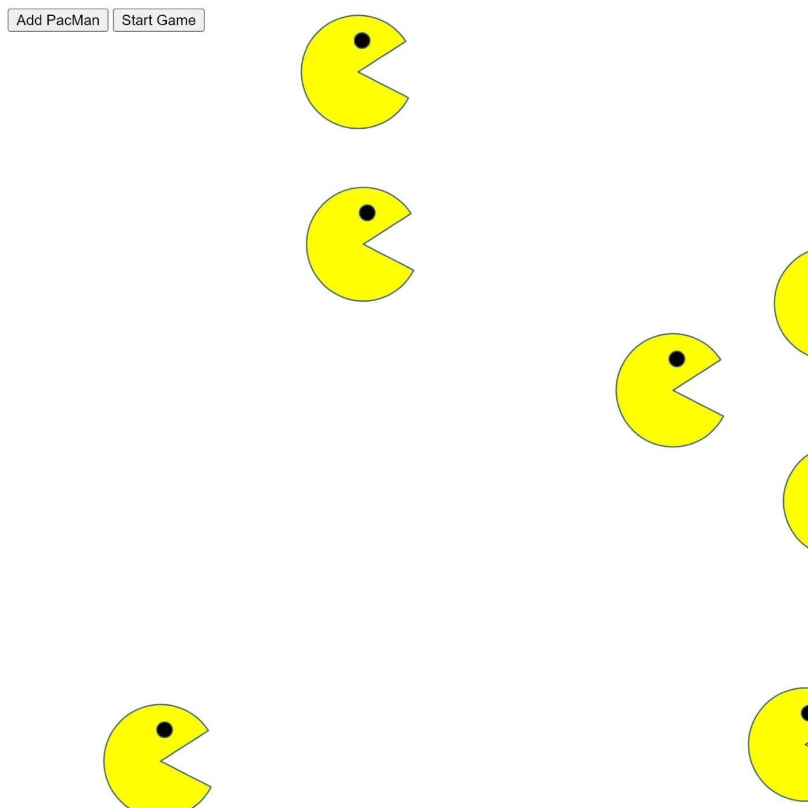

# PackMen-exercise

## Description
Clicking "Add PacMan" button makes PacMan images appear on the page, and the "Start Game" button starts to move the PacMen at different velocities and directions. The PacMen will bounce off of the edge of the screen and change directions.
For this project, I focused on DOM manipulation, and array methods. 

## How to run
Clone all files in this repo to your local drive. Open the index.html file in a browser. First, click the "Add PacMan" button. Each click makes a new, PacMan to the page. Then, click the "Start Game" button and the PacMen will begin to move at different velocities. You can add more PacMen after starting the game.

## Roadmap of future improvements
-add background image
-add more styles to the buttons

## Licence
Copyright 2020 John Williams

Permission is hereby granted, free of charge, to any person obtaining a copy of this software and associated documentation files (the "Software"), to deal in the Software without restriction, including without limitation the rights to use, copy, modify, merge, publish, distribute, sublicense, and/or sell copies of the Software, and to permit persons to whom the Software is furnished to do so, subject to the following conditions:

The above copyright notice and this permission notice shall be included in all copies or substantial portions of the Software.

THE SOFTWARE IS PROVIDED "AS IS", WITHOUT WARRANTY OF ANY KIND, EXPRESS OR IMPLIED, INCLUDING BUT NOT LIMITED TO THE WARRANTIES OF MERCHANTABILITY, FITNESS FOR A PARTICULAR PURPOSE AND NONINFRINGEMENT. IN NO EVENT SHALL THE AUTHORS OR COPYRIGHT HOLDERS BE LIABLE FOR ANY CLAIM, DAMAGES OR OTHER LIABILITY, WHETHER IN AN ACTION OF CONTRACT, TORT OR OTHERWISE, ARISING FROM, OUT OF OR IN CONNECTION WITH THE SOFTWARE OR THE USE OR OTHER DEALINGS IN THE SOFTWARE.

